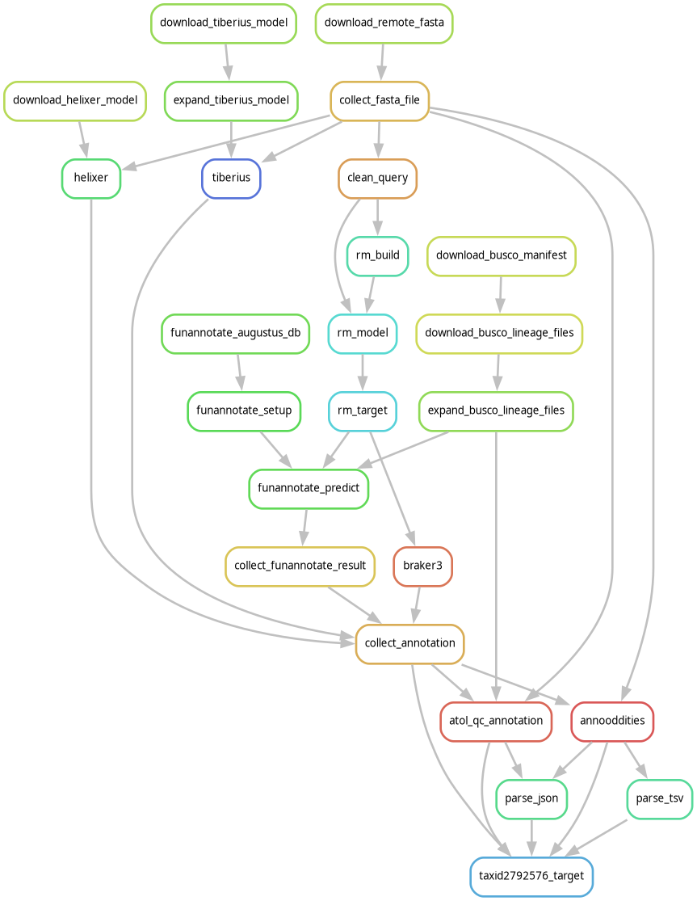

# Compare annotation tools

Run a set of different annotation tools on a genome and get standardised
metrics on the results.

## Usage

Specify the input genomes in YAML, e.g.

```yaml config/test.yaml
genomes:
  my_genome:
    augustus_dataset_name: "cacao"
    busco_lineage: "embryophyta_odb10"
    fasta_file: "test-data/genome.fa.gz"
    helixer_lineage: "land_plant"
    label: "Arabidopsis fragment"
    lineage: "embryophyta_odb10"
    ncbi_order: "Asparagales"
    rnaseq: "test-data/RNAseq.bam"
    run_softmasking: True
    softmasked: False
    taxon_id: 3702
    tiberius_model: "Eudicotyledons"
```

Pass it to snakmake using the `--configfile` option:

```bash
snakemake --configfile config.yaml
```

## Recommendations

### Softmasking

- Braker and funannotate require softmasked genomes.
- Helixer and **generally** don't require softmasked genomes.
  - The exception is if models were trained on softmasked genomes, like the
    [Eudicotyledons and Monocotyledonae Tiberius
    models](https://github.com/Gaius-Augustus/Tiberius/tree/main/model_cfg#1--list-of-current-model-weights)
- Helixer and Tiberius models for un-masked genomes [can be used with
  soft-masked
  genomes](https://github.com/gaius-Augustus/tiberius?tab=readme-ov-file#choosing-the-model-weights).

### BUSCO lineage for `funannotate`

Choosing the right BUSCO lineage for `funannotate` (`--busco_db` option) seems
to be hit and miss. We start with the closest parent lineage, and keep trying
higher-level DBs until we find one that works.

Sometimes `funannotate` fails at the BUSCO step, with an error like this:

```
ERROR 69: /usr/local/bin/../share/glimmerhmm/train/score exited funny: 35584 at /usr/local/bin/trainGlimmerHMM line 445.
```

Sometimes it fails like this:

```
[Jan 28 12:29 AM]: Running BUSCO to find conserved gene models for training ab-initio predictors
[Jan 28 01:01 AM]: 0 valid BUSCO predictions found, validating protein sequences
```

Neither error happens every time for a given lineage so it's probably caused by
certain combinations of genome and lineage. BUSCO DBs that work for QC on the
raw genome can fail in `funannotate`, so BUSCO version may be a factor too.
It's possible to override the BUSCO lineage for `funannotate` in the config,
like this:

```yaml
  test_genome:
    busco_lineage: "embryophyta_odb10"
    fasta_file: "test-data/genome.fa.gz"
    taxon_id: 3702
    overrides:
      funannotate:
        busco_lineage: "viridiplantae_odb10"
```

#### ODB12

ODB12 databases are incompadible with funannotate as of version 1.8.17.

To use an ODB12 database for QC and an ODB10 database for funnanotate, use the `overrides:` setting.

```yaml
  test_genome:
    busco_lineage: "embryophyta_odb12"
    fasta_file: "test-data/genome.fa.gz"
    taxon_id: 3702
    overrides:
      funannotate:
        busco_lineage: "embryophyta_odb10"
```


## Overview

Runs the following steps.




## TODO

- [ ] **REMOVE `05_smk_hack`**
  - Depends on this bug: https://github.com/snakemake/snakemake/issues/3916
- [x] handle remote genomes
  - [x] FIXME - currently assuming all downloaded genomes are fasta.gz
- [x] GPU resources - fill in the partitionflag and exclusive using yte
- [x] collect stats
- [x] collate resource usage
- [ ] implement annotation tools:
  - [x] tiberius
    - [x] add all the models
  - [x] helixer
    - [x] collate RAM usage for resources
  - [ ] annevo
  - [x] funannotate
    - [x] remove `--force` option for unmasked genomes
